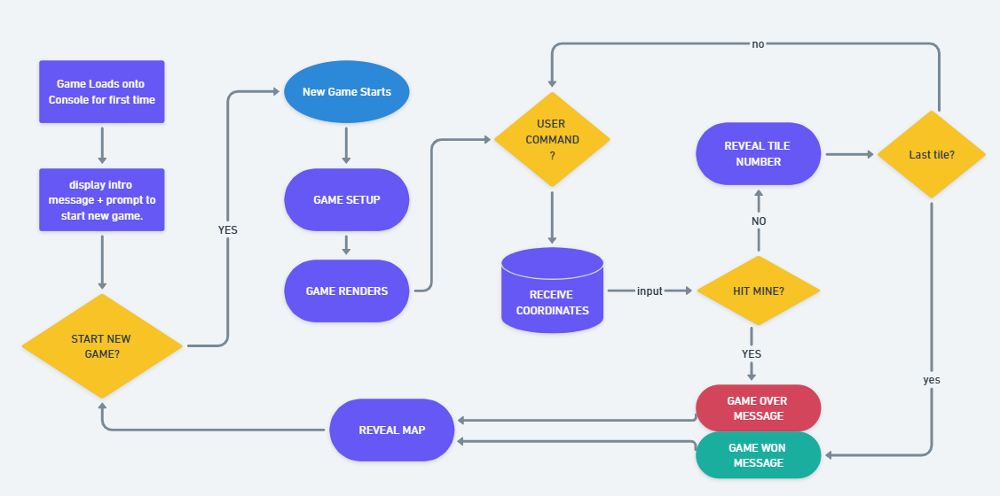

# Project: Minesweeper

# PROJECT OUTLINE

## MVP

Recreate a simplified version of the game Minesweeper to be played in the java console:

- [ ] The game should be able to randomly generate 10 mines in a 10x10 grid - (3x3 done)
- [] The user will be able to enter a command that represents a coordinate to check a location for a mine
- [] The application will display a number from 0-8 depending on how many mines surround that location - needs error handling
- [] If the user selects a mine, the game will respond "boom!" and the game will be lost
- [ ] If every non-mine square has been revealed, the game is won -testing
- [] Render the grid to the console after every user command

## Bonuses (optional)

- [ ] Allow for the user to configure number of mines and grid size via a configuration. - change int of new grid render (rows/columns)
- [ ] (Difficult) Discovering an empty square should reveal all squares around it, and cascade into other nearby empty squares - whole array manipultion? - arraylist?

# PLANNING NOTES

---

# Game Logic / Flow

- Link to diagram: https://whimsical.com/minesweeper-5Wn2mbHadbV3jbStGr1Ub4

## Phase 1: Game Loads onto Console for first time.

    - display intro message + prompt to start new game.
    - wait for player to yes 'Y' or 'yes' on Keyboard.
    - logic: Use a Scanner.

## Phase 2: New Game Starts

GENERATE HIDDEN MAP LAYER

- Location of mines (10) are randomly placed.

  - Hidden map/array is created.
  - 10 randomised coordinates on the map are given.
  - Mines are place inside.

- All other coordinates are given a number based on sum of adjacent mines.

  - Use an iterator?
  - place int number inside the given coordinate.

  Check NUMBER condition: How many squares surrounding the chosen coordinates contain a mine?

  - logic: Number must be from 0-8.
  - logic: all adjacent spaces of coordinates must be checked for mines.
  - rendering:
    - If 0, display blank space.
    - If 1-8, display number.

GENERATE + RENDER DISPLAYED MAP LAYER

- 10x10 Grid renders on console.
  - 100 hidden squares '?'
  - Extra space for coordinate labels on x/y axis.
- Displays user command input prompt message on console:
  - "Enter (x,y) coordinate to reveal square"
  - logic: x is row, y column in 10x10 grid map (array)

## Phase 3: Player Turn - Check Win/Continue/Lose Conditions.

---

1. Check LOSE condition: Is the square a mine?

   - logic: do any of mine coordinates the hidden map/array include the user's inputted coordinate?

   A. YES/TRUE: PLAYER LOSES.
   → print "boom! game over"
   -> ask to reset game
   → reset game (go to first step)

   B. NO/FALSE: Square is not a mine. -> go to 2.

2. Check WIN condition: Is the square the last remaining non-mine square?

   - logic: How many exist? (90, if 10 mines in 10x10 grid).
   - logic: How many have been revealed?

   YES/TRUE: PLAYER WINS.
   -> Display winner message.
   -> Reveal hidden map/array with all mine locations.
   -> Display user command prompt to reset the game. - "Play Again? Enter 'Y' to start a new game.

   NO/FALSE: Other no-mines squares still exist. -> Go to 3.

3. End of Player Turn, continue to next turn -> go to 1.

# Modularisation Approach

Why Modularize?

- Separation of Concerns – Each package has a clear responsibility.
- Scalability – Makes it easier to add new features later.
- Maintainability – Easier debugging and refactoring.

## MVC Naming convention

MVC is used to split the code into three parts:

1. Model (data)

- array values, mine placement, board generation
- model package -> GameBoard class

2. View (display)

- anything the player can see on the console
- view package -> BoardDisplay class

3. Controller (logic and input)

- game input, game flow/state, moves, win/lose conditions, game loop
- controller package -> GameController class

### Purpose/Benefits of MVC pattern:

MVC was designed to help organize code for graphical user interfaces by separating data (Model), user interface (View), and user input/logic (Controller). This separation makes programs easier to maintain and extend.

Overall benefit:

- Easier to maintain: You can change how the game looks (View) without changing the game logic (Model/Controller).

## Modularisation map

1. GameBoard class (`model` package)

   - Holds the grids (hiddenGrid, displayGrid)
   - Handles grid setup (placing mines, calculating numbers)
   - Provides getters/setters for grids

2. BoardDisplay class (`view` package)

   - Handles rendering grids to the console
   - Methods like renderDisplayGrid(GameBoard board) and renderHiddenGrid(GameBoard board)

3. GameController class (`controller` package)

   - Handles player moves, win/lose checks, and game loop
   - Methods like playerMove(GameBoard board), checkWin(GameBoard board)

4. MinesweeperApp class (main class)
   - Creates objects for GameBoard, BoardPrinter, and GameController
   - Runs the main game loop, coordinates everything
